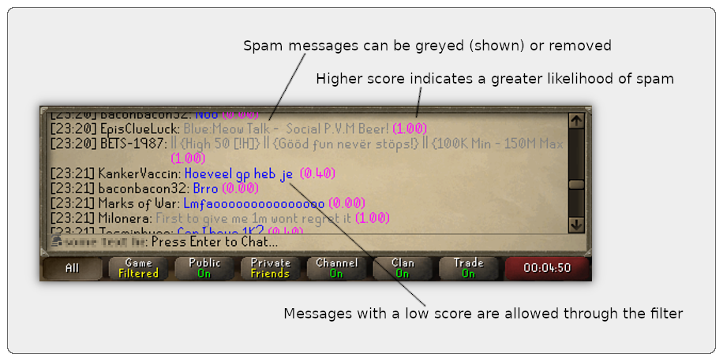
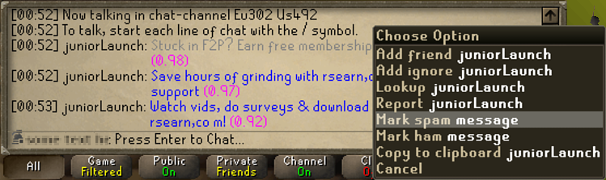

# Spam filter for RuneLite

A naive Bayesian spam filter for RuneLite based on Paul Graham's [A Plan for Spam](http://www.paulgraham.com/spam.html).

## Reporting spam or ham (training the filter)

The filter is preloaded with a small amount of data.
To make it effective against spam messages it hasn't seen before,
right click on a spam message in public chat and choose "mark spam".
You can do this to repeated spam messages;
each time you report an identical message, the filter will consider it and similar messages to be more "spammy".

The opposite of "mark spam" is "mark ham", which tells the filter that a message is _not_ spam.
__This option is hidden by default and must be enabled in the plugin settings__.

## Configuration

__Filter overheads__ stops spam messages from appearing above a player's head.
This is enabled by default.

__Filter type__ controls how spam messages are handled in the chat log.
"Grey messages" (enabled in these screenshots) shows spam messages but greys them out.
"Hide messages" is the default option and hides spam messages from the chat log entirely.

__Show spam scores__ (enabled in these screenshots) displays in the chat log how "spammy" the filter thinks each message is.
This is shown in magenta and is a number from _(0.00)_ to _(1.00)_.
This will show you the effect of marking a message as spam or ham.
This is disabled by default.

__Threshold__ controls how aggressive the spam filter is.
Its default value is 98%, meaning that messages with a spam score of _(0.98)_ or higher will be considered spam.

__Show "mark spam" right-click option__ enables the "mark spam" right-click option on public chat messages.
This is enabled by default.

__Show "mark ham" right-click option__ enables the "mark ham" right-click option on public chat messages.
This is disabled by default.

## Rough edges

This plugin was hacked together over the course of a rainy weekend.
It works well if you take the time to train the filter. However, be aware:

* It has limited training data out of the box
* Its code is unoptimised and may run slowly